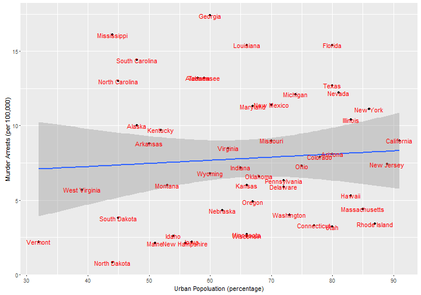
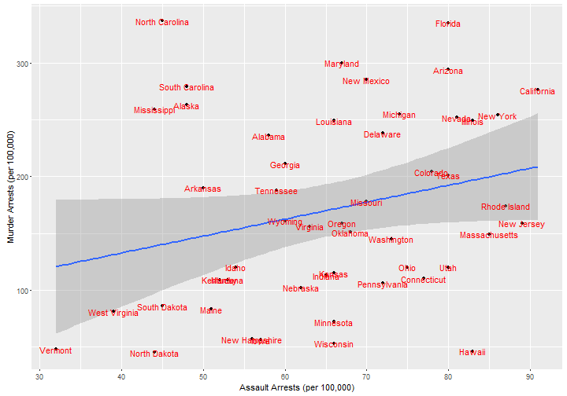
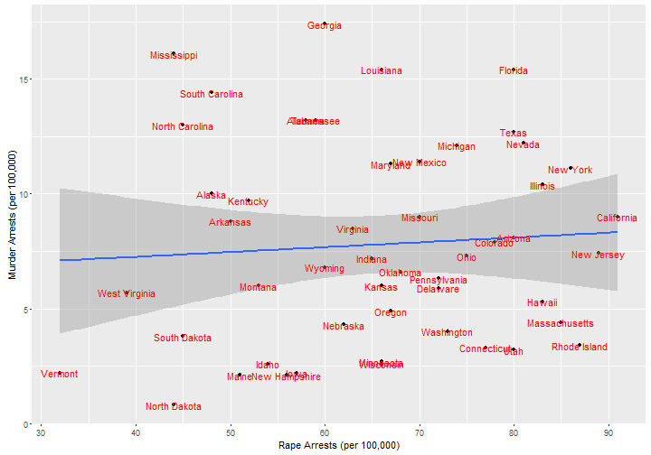

## Introduction

This presentation aims at studying the relationship between several types of crime arrests in the US by state. An interactive shiny app can be found in the following link.

[https://carubecas.shinyapps.io/my_app/](https://carubecas.shinyapps.io/my_app/)

The data set contains statistics, in arrests per 100,000 residents for assault, murder, and rape in each of the 50 US states in 1973. Also given is the percent of the population living in urban areas.


```r
head(USArrests)
```

```
##            Murder Assault UrbanPop Rape
## Alabama      13.2     236       58 21.2
## Alaska       10.0     263       48 44.5
## Arizona       8.1     294       80 31.0
## Arkansas      8.8     190       50 19.5
## California    9.0     276       91 40.6
## Colorado      7.9     204       78 38.7
```

--- .class #id 

## Murder vs. Urban Population



--- .class #id 

## Murder vs. Assault



--- .class #id 

## Murder vs. Rape



--- .class #id 

## ANOVA Analysis

The ANOVA analysis indicates that most of the variability on the murder arrests is explained by the assault arrests.


```
## Analysis of Variance Table
## 
## Model 1: Murder ~ Assault
## Model 2: Murder ~ Assault + Rape
## Model 3: Murder ~ Assault + Rape + UrbanPop
##   Res.Df    RSS Df Sum of Sq      F  Pr(>F)  
## 1     48 331.85                              
## 2     47 330.33  1    1.5148 0.2286 0.63484  
## 3     46 304.83  1   25.5025 3.8484 0.05586 .
## ---
## Signif. codes:  0 '***' 0.001 '**' 0.01 '*' 0.05 '.' 0.1 ' ' 1
```
